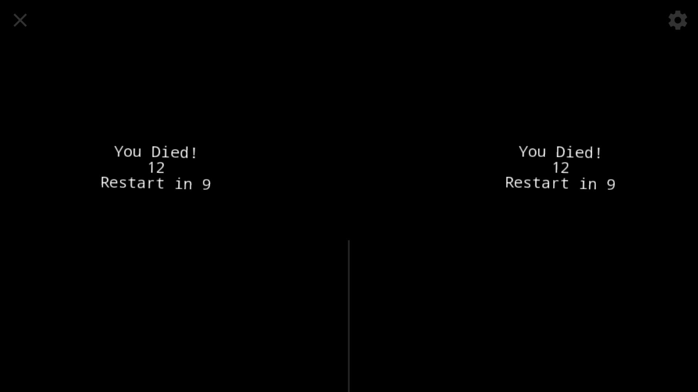

# VR-Platform-Game
## "Whiplash"

A VR game consisting of jumping over and ducking under platforms that progressively speed up.
Made this game Fall 2017 in Processing 

## Screenshots
Welcome Screen

Gameplay Views

End Screen

## Built With

* [Processing](https://processing.org/)
* [Processing for Android](https://android.processing.org/tutorials/vr_intro/index.html) - Library used to render 3D images on android phone
